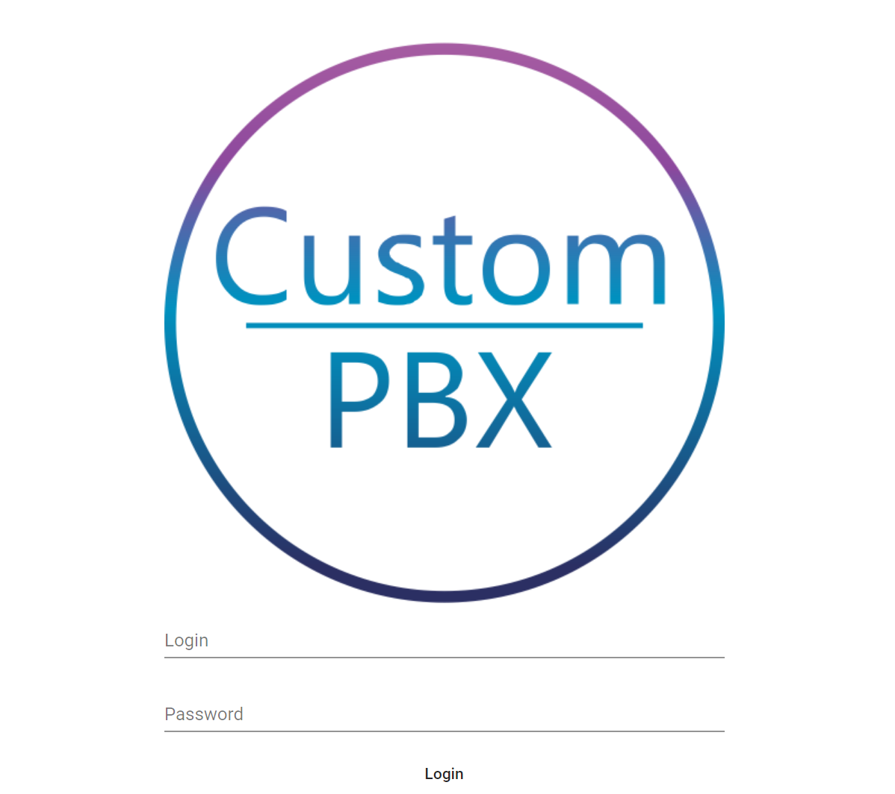
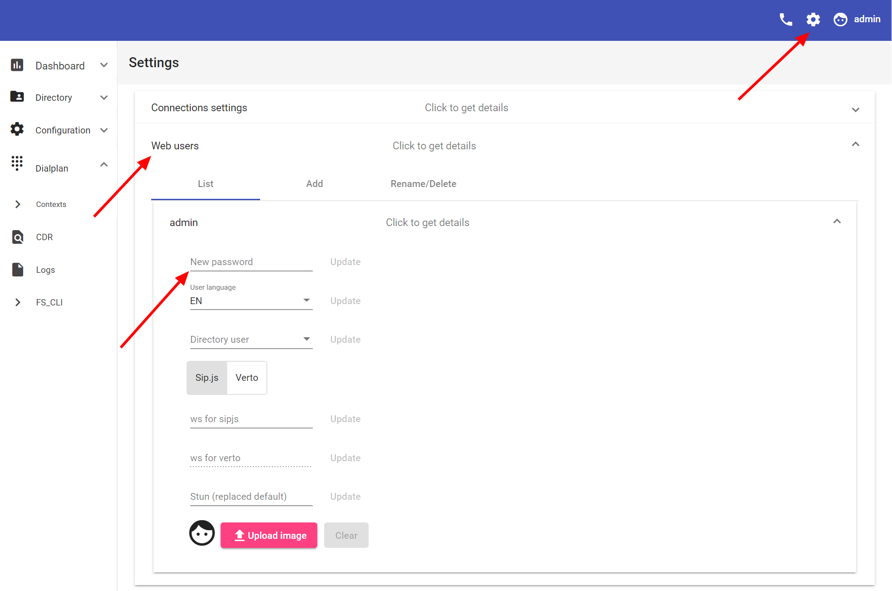
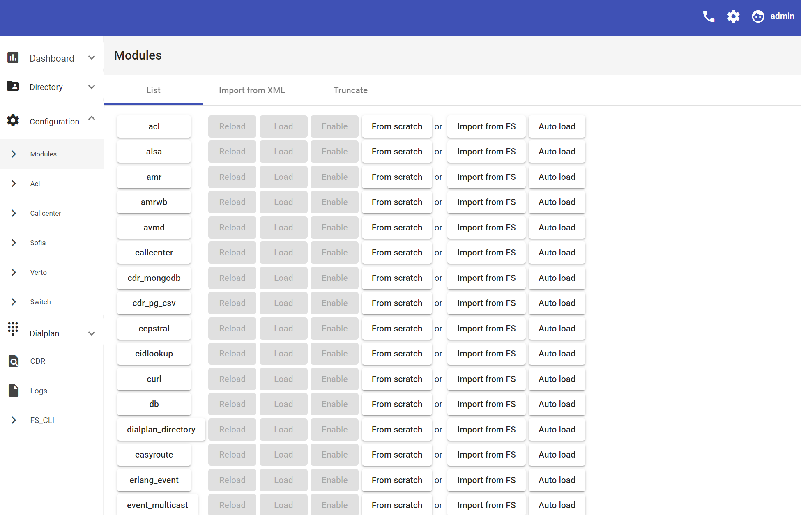
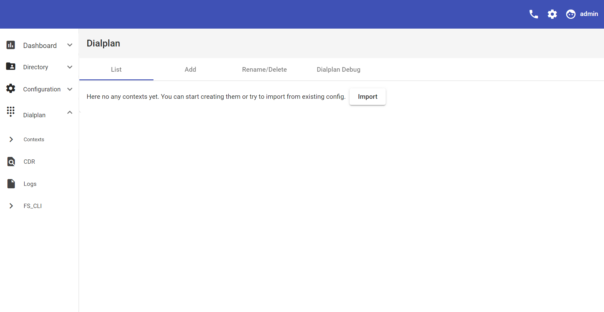

# Installation Guide
0. Get [Compiled CustomPbx binary](https://github.com/CustomPBX/cpbx/tree/master/bin)
1. Get FreeSWITCH
2. Get Postgres

3. Create Postgres User And Database  
    ```bash
    sudo -u postgres createuser <username>
    sudo -u postgres createdb <dbname>
    sudo -u postgres psql -c "ALTER USER <username> WITH ENCRYPTED PASSWORD '<password>'"
    sudo -u postgres psql -c "ALTER ROLE <username> WITH LOGIN"
    sudo -u postgres psql -c "GRANT all PRIVILEGES ON DATABASE <database> TO <username>"
    ```

4. Put [cpbx](https://github.com/CustomPBX/cpbx/tree/master/bin) binary file to server with `config.json` or just run and stop cpbx to create it.
    ```json
    {
        "freeswitch": {
            "esl": {
                "host": "127.0.0.1",
                "port": 8021,
                "pass": "ClueCon",
                "timeout": 10,
                "collect_logs": 7
            }
        },
        "webserver": {
            "route": "/ws",
            "host": "127.0.0.1",
            "port": 8080,
            "stun_port": 3478,
            "cert_path": "/etc/freeswitch/tls/wss.pem",
            "key_path": "/etc/freeswitch/tls/wss.pem"
        },
        "xml_curl_server": {
            "route": "/conf/config",
            "host": "127.0.0.1",
            "port": 8081,
            "cert_path": "/etc/freeswitch/tls/wss.pem",
            "key_path": "/etc/freeswitch/tls/wss.pem"
        },
        "database": {
            "name": "custompbx",
            "host": "127.0.0.1",
            "port": 5432,
            "user": "custompbx",
            "pass": "custompbx"
        }
    }
    ```

5. Change parameters accordingly your setup. To connect cpbx to FreeSWITCH and DB.  
6. To connect FreeSWITCH to cbpx make sure `mod_xml_curl` is uncommented in `modules.conf` at FreeSWITCH configs directory. Put `<param name="gateway-url" value="https://<xml_curl_server.host>:<xml_curl_server.port>/<xml_curl_server.route>" bindings="configuration|directory|dialplan"/>` and load or reload xml_curl after it.  
    When its done run cbpx again.
    
    Common on start output:  
    ```bash
    CustomPBX development version: 0.0.1
    Starting...
    DB
    Events Handler
    Cache
    ESL Connection and handlers
    FS logs collecting
    HEP collecting
    Connection to ESL
    Web Handlers
    Secure Web Server
    Secure XMLCurl Server
    STUN Server
    ```

7. Now open https://\<webserver HOST>:\<webserver PORT>/cweb
    Default credentials is Login: admin, Password: admin.  
    
    
    You will see dashboard as first page more data will appear on it after you import or create direcoty and sofia configs.
8. For change default password go to settings as shown at screen shot.  
    

    Now time to set up or import FreeSWITCH configs.  
    ⚠WARNING: on importing configs right from FreeSWITCH all global variables will be resolved into their values.

9. For import Directory go to Directory>Domains andpres import - or Add new domain from scratch or xml.  
    
    
    I case imort you will get imported all domains, users, groups and gateways at one time. In case you need to reimport just remove all domains to button import appear.  
    Remember in case domain not exists in CustomPBX it will return Not Found and FreeSWITCH will look it in XML config files.

10. With Modules and Dialplan all doing in a similar way.  
    
    
      
    
